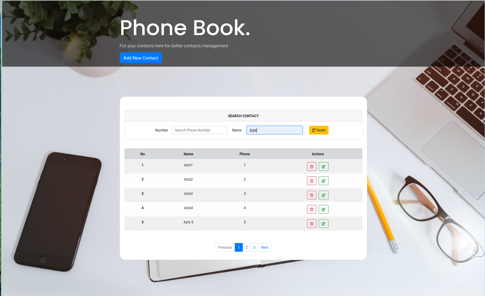
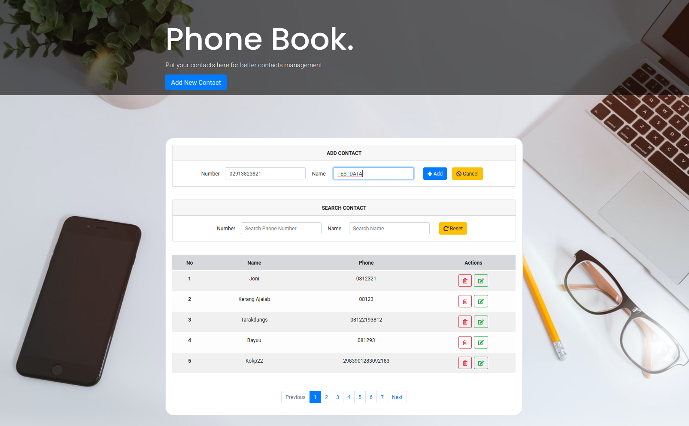
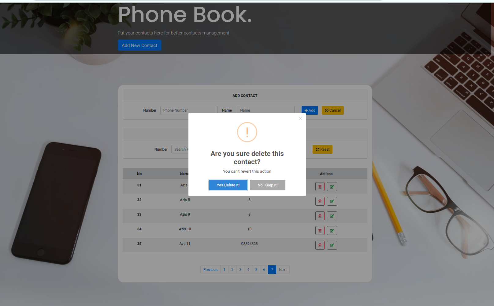
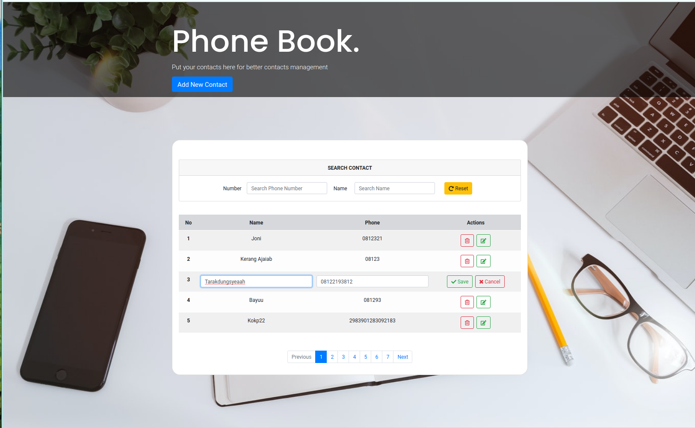

# PHONE BOOK REACT APPS

**is a simple web app to managing work flow in a system.**

Stack technologies :

- Node.js (express)
- React redux
- Firebase real time and GraphQl as database
- NPM (others package)
- Bootstrap 4.0 (View)

FEATURE :

- Search contacts
- Add,Edit and Delete Contacts
- Included with pagination

 SEARCH WITH PAGINATION

 ADD CONTACT WITH CTA BUTTON

 DELETE CONTACT WITH CONFIRMATION

 EDIT WITH DINAMIC TABLE

